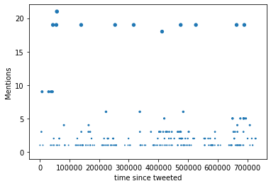
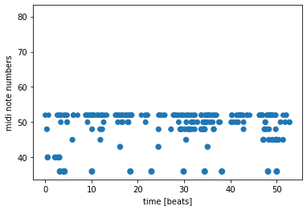

You can view and interact with the code by clicking here --> [](https://mybinder.org/v2/gh/ardaarslanbakan/Sonification-of-Bilkent-Tweets/main?labpath=Sonification%20of%20Bilkent%20Tweets.ipynb)




> Based on the project by [SYSTEMSound](https://github.com/SYSTEMSounds/sonification-tutorials) 
## 1) Load data (.csv file)


```python
import pandas as pd   #import library for loading data, https://pypi.org/project/pandas/

filename = 'bilkent_twitter'  #name of csv data file

df = pd.read_csv('./data/' + filename + '.csv',on_bad_lines='skip')  #load data as a pandas dataframe


df = df.sort_values(by=['time'], ascending=False)
#sorting data from newest to oldest tweet 

```

    716 Mentions


<div>
<style scoped>
    .dataframe tbody tr th:only-of-type {
        vertical-align: middle;
    }

    .dataframe tbody tr th {
        vertical-align: top;
    }

    .dataframe thead th {
        text-align: right;
    }
</style>
<table border="1" class="dataframe">
  <thead>
    <tr style="text-align: right;">
      <th></th>
      <th>Tweet Id</th>
      <th>Text</th>
      <th>Name</th>
      <th>Screen Name</th>
      <th>UTC</th>
      <th>time</th>
      <th>Favorites</th>
      <th>Retweets</th>
      <th>Language</th>
      <th>Client</th>
      <th>Tweet Type</th>
      <th>URLs</th>
      <th>Hashtags</th>
      <th>Mentions</th>
      <th>Media Type</th>
      <th>Media URLs</th>
      <th>Unnamed: 16</th>
      <th>Unnamed: 17</th>
      <th>Unnamed: 18</th>
    </tr>
  </thead>
  <tbody>
    <tr>
      <th>320</th>
      <td>1530058131656658944</td>
      <td>@ttllol_ Bilkent Türkiye'nin top okullarından....</td>
      <td>Melis</td>
      <td>nthreallymatter</td>
      <td>2022-05-27 05:27:40.000</td>
      <td>Fri May 27 05:27:40 +0000 2022</td>
      <td>0</td>
      <td>0</td>
      <td>tr</td>
      <td>&lt;a href="http://twitter.com/download/android" ...</td>
      <td>Reply</td>
      <td>NaN</td>
      <td>0</td>
      <td>1</td>
      <td>NaN</td>
      <td>NaN</td>
      <td>NaN</td>
      <td>NaN</td>
      <td>NaN</td>
    </tr>
    <tr>
      <th>321</th>
      <td>1530054162372825088</td>
      <td>RT @MustafaAlperen : Panel: "Türkiye, AB Döngü...</td>
      <td>M.Alperen Özdemir</td>
      <td>MustafaAlperen</td>
      <td>2022-05-27 05:11:53.000</td>
      <td>Fri May 27 05:11:53 +0000 2022</td>
      <td>0</td>
      <td>0</td>
      <td>tr</td>
      <td>&lt;a href="http://twitter.com/download/iphone" r...</td>
      <td>Retweet</td>
      <td>NaN</td>
      <td>2</td>
      <td>0</td>
      <td>photo</td>
      <td>https://pbs.twimg.com/media/FTr9jMPWUAM70s2.jpg</td>
      <td>https://pbs.twimg.com/media/FTr9jMaX0AE7A5x.jpg</td>
      <td>NaN</td>
      <td>NaN</td>
    </tr>
    <tr>
      <th>322</th>
      <td>1530042774866669568</td>
      <td>@quantumcatto i can confirm bilkent stockholm ...</td>
      <td>berfie @ 🌙🌃 brainrot</td>
      <td>berfieglyph</td>
      <td>2022-05-27 04:26:39.000</td>
      <td>Fri May 27 04:26:39 +0000 2022</td>
      <td>2</td>
      <td>0</td>
      <td>en</td>
      <td>&lt;a href="https://mobile.twitter.com" rel="nofo...</td>
      <td>Reply</td>
      <td>NaN</td>
      <td>0</td>
      <td>1</td>
      <td>NaN</td>
      <td>NaN</td>
      <td>NaN</td>
      <td>NaN</td>
      <td>NaN</td>
    </tr>
    <tr>
      <th>323</th>
      <td>1529998609810341890</td>
      <td>RT @dogilibira : Hazırlanmak için stüdyolara b...</td>
      <td>Görkem Özdemir</td>
      <td>GrkmZdmr0</td>
      <td>2022-05-27 01:31:09.000</td>
      <td>Fri May 27 01:31:09 +0000 2022</td>
      <td>0</td>
      <td>0</td>
      <td>tr</td>
      <td>&lt;a href="http://twitter.com/download/android" ...</td>
      <td>Retweet</td>
      <td>https://twitter.com/speletura/status/152993000...</td>
      <td>0</td>
      <td>0</td>
      <td>photo</td>
      <td>https://pbs.twimg.com/media/FTtup9TXwBYWRPC.jpg</td>
      <td>NaN</td>
      <td>NaN</td>
      <td>NaN</td>
    </tr>
    <tr>
      <th>324</th>
      <td>1529985829577404419</td>
      <td>RT @genemach1ne : Bilkent'i ilk günden özlüyor...</td>
      <td>Inji</td>
      <td>InjiNovruz</td>
      <td>2022-05-27 00:40:22.000</td>
      <td>Fri May 27 00:40:22 +0000 2022</td>
      <td>0</td>
      <td>0</td>
      <td>tr</td>
      <td>&lt;a href="http://twitter.com/download/iphone" r...</td>
      <td>Retweet</td>
      <td>NaN</td>
      <td>0</td>
      <td>0</td>
      <td>NaN</td>
      <td>NaN</td>
      <td>NaN</td>
      <td>NaN</td>
      <td>NaN</td>
    </tr>
  </tbody>
</table>
</div>


## 2) Plot data


```python
import matplotlib.pylab as plt  
import numpy as np

import datetime
import time
import calendar
import datetime
 


ages = df['UTC'].values    
ages=ages.tolist()
print(ages)
for i in range(len(ages)):
    print(i)
    ages[i]=ages[i].replace("-", " ").replace(":"," ").replace(".000","").replace(" ","")
    print(ages[i])
    ages[i] = datetime.datetime.strptime(ages[i], '%Y%m%d%H%M%S')
    ages[i] = ages[i].timestamp()
    


diameters = df['Mentions'].values 
plt.scatter(ages, diameters, s=diameters)
plt.xlabel('time tweeted')
plt.ylabel('Mentions')
plt.show()


times_myrs = max(ages) - np.array(ages)  #measure time from oldest crater (first impact) in data

plt.scatter(times_myrs, diameters, s=diameters)
plt.xlabel('time since tweeted')
plt.ylabel('Mentions')
plt.show()


```

    ['2022-05-25 22:27:23.000 ', '2022-05-25 22:25:51.000 ', '2022-05-25 22:13:17.000 ', '2022-05-25 22:09:46.000 ', '2022-05-25 22:06:23.000 ', '2022-05-25 21:45:40.000 ', '2022-05-25 21:13:01.000 ', '2022-05-25 20:46:10.000 ', '2022-05-25 20:40:35.000 ', '2022-05-25 20:28:27.000 ', '2022-05-25 20:22:18.000 ', '2022-05-25 20:10:26.000 ', '2022-05-25 20:05:55.000 ', '2022-05-25 20:02:35.000 ', '2022-05-25 20:01:07.000 ', '2022-05-25 19:58:21.000 ', '2022-05-25 19:50:27.000 ', '2022-05-25 19:49:31.000 ', '2022-05-25 19:44:26.000 ', '2022-05-25 19:32:45.000 ', '2022-05-25 19:30:46.000 ', '2022-05-25 19:23:06.000 ', '2022-05-25 19:22:27.000 ', '2022-05-25 19:21:11.000 ', '2022-05-25 19:20:27.000 ', '2022-05-25 19:12:36.000 ', '2022-05-25 18:56:07.000 ', '2022-05-25 18:43:34.000 ', '2022-05-25 18:42:19.000 ', '2022-05-25 18:40:55.000 ', '2022-05-25 18:35:39.000 ', '2022-05-25 18:27:18.000 ', '2022-05-25 18:22:55.000 ', '2022-05-25 18:18:03.000 ', '2022-05-25 18:10:25.000 ', '2022-05-25 18:06:51.000 ', '2022-05-25 18:04:38.000 ', '2022-05-25 18:04:04.000 ', '2022-05-25 18:01:14.000 ', '2022-05-25 17:58:32.000 ', '2022-05-25 17:56:54.000 ', '2022-05-25 17:56:35.000 ', '2022-05-25 17:43:26.000 ', '2022-05-25 17:40:58.000 ', '2022-05-25 17:36:40.000 ', '2022-05-25 17:32:18.000 ', '2022-05-25 17:16:54.000 ', '2022-05-25 17:07:41.000 ', '2022-05-25 16:59:21.000 ', '2022-05-25 16:51:31.000 ', '2022-05-25 16:44:48.000 ', '2022-05-25 16:39:16.000 ', '2022-05-25 16:25:11.000 ', '2022-05-25 16:17:48.000 ', '2022-05-25 16:14:05.000 ', '2022-05-25 16:11:08.000 ', '2022-05-25 16:10:43.000 ', '2022-05-25 15:54:11.000 ', '2022-05-25 15:41:03.000 ', '2022-05-25 15:26:48.000 ', '2022-05-25 15:17:59.000 ', '2022-05-25 15:10:53.000 ', '2022-05-25 15:10:33.000 ', '2022-05-25 15:10:28.000 ', '2022-05-25 15:07:31.000 ', '2022-05-25 14:27:48.000 ', '2022-05-25 13:44:04.000 ', '2022-05-25 13:34:17.000 ', '2022-05-25 13:10:01.000 ', '2022-05-25 12:59:49.000 ', '2022-05-25 12:56:46.000 ', '2022-05-25 12:54:12.000 ', '2022-05-25 12:50:24.000 ', '2022-05-25 12:18:03.000 ', '2022-05-25 12:08:57.000 ', '2022-05-25 11:52:14.000 ', '2022-05-25 11:47:15.000 ', '2022-05-25 11:43:05.000 ', '2022-05-25 11:41:19.000 ', '2022-05-25 11:04:47.000 ', '2022-05-25 11:04:40.000 ', '2022-05-25 10:27:09.000 ', '2022-05-25 10:18:35.000 ', '2022-05-25 09:41:02.000 ', '2022-05-25 09:00:00.000 ', '2022-05-25 08:57:01.000 ', '2022-05-25 08:39:28.000 ', '2022-05-25 08:10:36.000 ', '2022-05-25 07:50:32.000 ', '2022-05-25 06:52:43.000 ', '2022-05-25 05:16:04.000 ', '2022-05-25 03:18:03.000 ', '2022-05-31 07:33:42.000 ', '2022-05-31 07:27:24.000 ', '2022-05-31 07:24:53.000 ', '2022-05-31 07:24:38.000 ', '2022-05-31 06:34:32.000 ', '2022-05-31 06:30:31.000 ', '2022-05-31 06:06:00.000 ', '2022-05-31 06:04:48.000 ', '2022-05-31 05:27:57.000 ', '2022-05-31 04:41:19.000 ', '2022-05-31 04:32:06.000 ', '2022-05-31 03:27:28.000 ', '2022-05-31 01:47:25.000 ', '2022-05-31 01:43:55.000 ', '2022-05-31 00:46:05.000 ', '2022-05-24 23:21:38.000 ', '2022-05-24 21:33:41.000 ', '2022-05-24 21:13:27.000 ', '2022-05-24 21:03:50.000 ', '2022-05-24 20:56:20.000 ', '2022-05-24 20:56:14.000 ', '2022-05-24 20:55:31.000 ', '2022-05-24 20:33:34.000 ', '2022-05-24 19:09:15.000 ', '2022-05-24 18:03:48.000 ', '2022-05-24 17:43:48.000 ', '2022-05-24 17:41:32.000 ', '2022-05-24 17:18:04.000 ', '2022-05-24 17:01:54.000 ', '2022-05-24 16:40:12.000 ', '2022-05-24 16:39:04.000 ', '2022-05-24 16:36:11.000 ', '2022-05-24 16:32:27.000 ', '2022-05-24 16:09:20.000 ', '2022-05-24 16:02:52.000 ', '2022-05-24 15:49:47.000 ', '2022-05-24 15:49:33.000 ', '2022-05-24 15:49:23.000 ', '2022-05-24 15:46:49.000 ', '2022-05-24 15:42:51.000 ', '2022-05-24 14:44:44.000 ', '2022-05-24 14:39:43.000 ', '2022-05-24 14:35:09.000 ', '2022-05-24 14:33:39.000 ', '2022-05-24 14:27:14.000 ', '2022-05-24 14:01:36.000 ', '2022-05-24 13:55:30.000 ', '2022-05-24 13:45:24.000 ', '2022-05-24 13:37:19.000 ', '2022-05-24 13:32:15.000 ', '2022-05-24 13:27:31.000 ', '2022-05-24 13:09:58.000 ', '2022-05-24 12:51:59.000 ', '2022-05-24 12:37:41.000 ', '2022-05-24 11:34:02.000 ', '2022-05-24 11:21:09.000 ', '2022-05-24 11:20:49.000 ', '2022-05-24 11:13:29.000 ', '2022-05-24 11:13:29.000 ', '2022-05-24 11:10:48.000 ', '2022-05-24 11:04:34.000 ', '2022-05-24 11:03:20.000 ', '2022-05-24 10:33:08.000 ', '2022-05-24 10:31:37.000 ', '2022-05-24 10:07:15.000 ', '2022-05-24 10:05:06.000 ', '2022-05-24 09:54:16.000 ', '2022-05-24 09:48:20.000 ', '2022-05-24 09:32:15.000 ', '2022-05-24 08:37:22.000 ', '2022-05-24 08:36:08.000 ', '2022-05-24 08:26:33.000 ', '2022-05-24 08:22:41.000 ', '2022-05-24 08:22:20.000 ', '2022-05-24 08:19:08.000 ', '2022-05-24 08:19:04.000 ', '2022-05-24 07:54:47.000 ', '2022-05-24 07:38:18.000 ', '2022-05-24 07:38:17.000 ', '2022-05-24 06:44:55.000 ', '2022-05-24 06:42:27.000 ', '2022-05-24 06:15:11.000 ', '2022-05-24 06:07:13.000 ', '2022-05-24 05:19:39.000 ', '2022-05-24 04:33:24.000 ', '2022-05-24 02:54:09.000 ', '2022-05-24 02:38:48.000 ', '2022-05-24 00:30:01.000 ', '2022-05-24 00:26:41.000 ', '2022-05-26 23:56:49.000 ', '2022-05-26 23:23:23.000 ', '2022-05-26 22:26:22.000 ', '2022-05-26 22:00:07.000 ', '2022-05-26 21:33:10.000 ', '2022-05-26 21:30:59.000 ', '2022-05-26 21:30:32.000 ', '2022-05-26 21:28:47.000 ', '2022-05-26 21:19:25.000 ', '2022-05-26 20:58:40.000 ', '2022-05-26 20:57:45.000 ', '2022-05-26 20:27:57.000 ', '2022-05-26 20:26:02.000 ', '2022-05-26 20:25:46.000 ', '2022-05-26 19:27:27.000 ', '2022-05-26 19:17:47.000 ', '2022-05-26 18:50:03.000 ', '2022-05-26 18:42:22.000 ', '2022-05-26 18:04:13.000 ', '2022-05-26 17:28:12.000 ', '2022-05-26 17:18:20.000 ', '2022-05-26 17:00:25.000 ', '2022-05-26 16:59:29.000 ', '2022-05-26 16:34:57.000 ', '2022-05-26 16:31:52.000 ', '2022-05-26 16:22:52.000 ', '2022-05-26 16:18:38.000 ', '2022-05-26 16:09:14.000 ', '2022-05-26 16:06:29.000 ', '2022-05-26 15:43:25.000 ', '2022-05-26 15:36:30.000 ', '2022-05-26 15:32:32.000 ', '2022-05-26 15:23:04.000 ', '2022-05-26 15:13:21.000 ', '2022-05-26 15:07:33.000 ', '2022-05-26 14:42:05.000 ', '2022-05-26 14:34:59.000 ', '2022-05-26 14:29:34.000 ', '2022-05-26 13:16:49.000 ', '2022-05-26 13:14:07.000 ', '2022-05-26 13:03:55.000 ', '2022-05-26 12:58:10.000 ', '2022-05-26 12:58:05.000 ', '2022-05-26 12:56:56.000 ', '2022-05-26 12:56:55.000 ', '2022-05-26 12:55:58.000 ', '2022-05-26 12:07:27.000 ', '2022-05-26 11:57:49.000 ', '2022-05-26 11:57:34.000 ', '2022-05-26 11:30:37.000 ', '2022-05-26 10:54:42.000 ', '2022-05-26 10:52:45.000 ', '2022-05-26 10:52:05.000 ', '2022-05-26 10:47:04.000 ', '2022-05-26 10:44:30.000 ', '2022-05-26 10:39:36.000 ', '2022-05-26 10:36:28.000 ', '2022-05-26 10:35:20.000 ', '2022-05-26 09:44:42.000 ', '2022-05-26 09:44:30.000 ', '2022-05-26 09:34:28.000 ', '2022-05-26 09:32:57.000 ', '2022-05-26 09:32:19.000 ', '2022-05-26 09:31:47.000 ', '2022-05-26 09:29:51.000 ', '2022-05-26 09:25:30.000 ', '2022-05-26 08:50:48.000 ', '2022-05-26 08:47:18.000 ', '2022-05-26 08:30:08.000 ', '2022-05-26 08:22:35.000 ', '2022-05-26 08:21:01.000 ', '2022-05-26 08:19:00.000 ', '2022-05-26 08:18:55.000 ', '2022-05-26 08:07:02.000 ', '2022-05-26 08:02:24.000 ', '2022-05-26 06:34:01.000 ', '2022-05-26 06:30:19.000 ', '2022-05-26 06:26:05.000 ', '2022-05-26 06:21:06.000 ', '2022-05-26 06:20:39.000 ', '2022-05-26 06:20:36.000 ', '2022-05-26 05:24:22.000 ', '2022-05-26 05:14:12.000 ', '2022-05-26 04:47:22.000 ', '2022-05-26 04:39:08.000 ', '2022-05-26 04:28:03.000 ', '2022-05-26 03:52:13.000 ', '2022-05-26 03:26:58.000 ', '2022-05-26 01:33:17.000 ', '2022-05-26 01:26:54.000 ', '2022-05-29 23:40:49.000 ', '2022-05-29 23:26:17.000 ', '2022-05-29 22:26:11.000 ', '2022-05-29 22:15:00.000 ', '2022-05-29 22:04:43.000 ', '2022-05-29 22:01:46.000 ', '2022-05-29 21:32:17.000 ', '2022-05-29 21:17:19.000 ', '2022-05-29 20:56:20.000 ', '2022-05-29 20:48:14.000 ', '2022-05-29 20:36:34.000 ', '2022-05-29 20:32:16.000 ', '2022-05-29 20:27:41.000 ', '2022-05-29 20:25:33.000 ', '2022-05-29 20:24:05.000 ', '2022-05-29 19:39:33.000 ', '2022-05-29 19:25:05.000 ', '2022-05-29 19:23:10.000 ', '2022-05-29 19:16:18.000 ', '2022-05-29 19:04:28.000 ', '2022-05-29 18:59:33.000 ', '2022-05-29 18:36:11.000 ', '2022-05-29 18:16:19.000 ', '2022-05-29 17:59:02.000 ', '2022-05-29 17:54:54.000 ', '2022-05-29 17:37:35.000 ', '2022-05-29 17:21:33.000 ', '2022-05-29 17:11:59.000 ', '2022-05-29 16:53:49.000 ', '2022-05-29 16:49:02.000 ', '2022-05-29 16:40:31.000 ', '2022-05-29 16:03:15.000 ', '2022-05-29 16:02:21.000 ', '2022-05-29 15:47:29.000 ', '2022-05-29 15:45:32.000 ', '2022-05-29 15:39:56.000 ', '2022-05-29 15:39:55.000 ', '2022-05-29 15:39:46.000 ', '2022-05-29 15:39:46.000 ', '2022-05-29 15:37:08.000 ', '2022-05-29 15:30:29.000 ', '2022-05-29 15:13:18.000 ', '2022-05-29 14:53:22.000 ', '2022-05-29 14:18:05.000 ', '2022-05-29 13:22:14.000 ', '2022-05-29 13:19:28.000 ', '2022-05-29 13:18:31.000 ', '2022-05-29 12:25:33.000 ', '2022-05-29 12:21:57.000 ', '2022-05-29 12:19:25.000 ', '2022-05-29 11:58:38.000 ', '2022-05-29 11:31:25.000 ', '2022-05-29 11:25:18.000 ', '2022-05-29 10:47:49.000 ', '2022-05-29 10:30:09.000 ', '2022-05-29 10:29:45.000 ', '2022-05-29 10:26:22.000 ', '2022-05-29 10:00:11.000 ', '2022-05-29 09:50:21.000 ', '2022-05-29 09:00:00.000 ', '2022-05-29 08:23:32.000 ', '2022-05-29 08:22:57.000 ', '2022-05-29 08:22:55.000 ', '2022-05-29 08:15:52.000 ', '2022-05-29 08:06:53.000 ', '2022-05-29 08:00:01.000 ', '2022-05-29 07:31:54.000 ', '2022-05-29 07:18:30.000 ', '2022-05-29 07:07:46.000 ', '2022-05-29 06:56:39.000 ', '2022-05-29 06:48:06.000 ', '2022-05-29 06:42:21.000 ', '2022-05-29 06:31:36.000 ', '2022-05-29 06:11:14.000 ', '2022-05-29 04:35:09.000 ', '2022-05-22 23:58:38.000 ', '2022-05-22 22:51:33.000 ', '2022-05-22 21:48:29.000 ', '2022-05-22 21:37:47.000 ', '2022-05-22 21:35:29.000 ', '2022-05-22 21:27:34.000 ', '2022-05-22 21:26:43.000 ', '2022-05-22 21:15:10.000 ', '2022-05-22 21:10:45.000 ', '2022-05-22 21:08:32.000 ', '2022-05-28 21:23:34.000 ', '2022-05-28 20:50:30.000 ', '2022-05-28 20:50:01.000 ', '2022-05-28 20:47:31.000 ', '2022-05-28 20:26:31.000 ', '2022-05-28 19:58:32.000 ', '2022-05-28 19:32:44.000 ', '2022-05-28 19:22:25.000 ', '2022-05-28 19:21:32.000 ', '2022-05-28 18:55:56.000 ', '2022-05-28 18:07:57.000 ', '2022-05-28 17:44:35.000 ', '2022-05-28 17:32:25.000 ', '2022-05-28 16:54:50.000 ', '2022-05-28 16:49:24.000 ', '2022-05-28 16:48:39.000 ', '2022-05-28 16:42:38.000 ', '2022-05-28 15:59:47.000 ', '2022-05-28 15:59:34.000 ', '2022-05-28 15:40:58.000 ', '2022-05-28 15:27:47.000 ', '2022-05-28 15:23:57.000 ', '2022-05-28 15:21:57.000 ', '2022-05-28 15:14:31.000 ', '2022-05-28 14:50:28.000 ', '2022-05-28 14:19:33.000 ', '2022-05-28 14:18:02.000 ', '2022-05-28 13:10:41.000 ', '2022-05-28 12:55:54.000 ', '2022-05-28 12:40:49.000 ', '2022-05-28 11:58:59.000 ', '2022-05-28 11:07:36.000 ', '2022-05-28 11:07:24.000 ', '2022-05-28 10:46:04.000 ', '2022-05-28 10:41:27.000 ', '2022-05-28 10:40:01.000 ', '2022-05-28 10:37:31.000 ', '2022-05-28 10:37:29.000 ', '2022-05-28 10:37:01.000 ', '2022-05-28 10:26:12.000 ', '2022-05-28 10:23:21.000 ', '2022-05-28 10:07:29.000 ', '2022-05-28 09:39:54.000 ', '2022-05-28 09:34:54.000 ', '2022-05-28 09:28:43.000 ', '2022-05-28 09:11:56.000 ', '2022-05-28 09:00:52.000 ', '2022-05-28 08:44:34.000 ', '2022-05-28 08:03:46.000 ', '2022-05-28 08:01:29.000 ', '2022-05-28 07:54:55.000 ', '2022-05-28 07:52:07.000 ', '2022-05-28 07:43:11.000 ', '2022-05-28 07:13:12.000 ', '2022-05-28 06:27:02.000 ', '2022-05-28 02:03:15.000 ', '2022-05-28 00:28:44.000 ', '2022-05-30 23:18:21.000 ', '2022-05-30 23:00:43.000 ', '2022-05-30 22:32:25.000 ', '2022-05-30 21:31:09.000 ', '2022-05-30 21:17:46.000 ', '2022-05-30 21:16:29.000 ', '2022-05-30 21:16:05.000 ', '2022-05-30 21:15:44.000 ', '2022-05-30 21:11:11.000 ', '2022-05-30 21:11:04.000 ', '2022-05-30 21:01:27.000 ', '2022-05-30 21:00:35.000 ', '2022-05-30 20:55:16.000 ', '2022-05-30 20:51:37.000 ', '2022-05-30 20:39:59.000 ', '2022-05-30 20:36:43.000 ', '2022-05-30 20:33:20.000 ', '2022-05-30 20:32:01.000 ', '2022-05-30 20:31:35.000 ', '2022-05-30 20:31:28.000 ', '2022-05-30 20:30:37.000 ', '2022-05-30 20:30:30.000 ', '2022-05-30 20:28:52.000 ', '2022-05-30 20:28:03.000 ', '2022-05-30 20:25:34.000 ', '2022-05-30 20:25:22.000 ', '2022-05-30 20:23:29.000 ', '2022-05-30 20:22:58.000 ', '2022-05-30 20:15:10.000 ', '2022-05-30 20:13:24.000 ', '2022-05-30 20:11:19.000 ', '2022-05-30 20:10:45.000 ', '2022-05-30 20:08:22.000 ', '2022-05-30 20:07:44.000 ', '2022-05-30 20:06:43.000 ', '2022-05-30 20:02:18.000 ', '2022-05-30 20:00:25.000 ', '2022-05-30 20:00:02.000 ', '2022-05-30 19:59:47.000 ', '2022-05-30 19:59:43.000 ', '2022-05-30 19:59:04.000 ', '2022-05-30 19:48:13.000 ', '2022-05-30 19:47:18.000 ', '2022-05-30 19:21:15.000 ', '2022-05-30 19:18:20.000 ', '2022-05-30 19:17:22.000 ', '2022-05-30 18:35:25.000 ', '2022-05-30 18:33:48.000 ', '2022-05-30 18:31:30.000 ', '2022-05-30 18:20:57.000 ', '2022-05-30 17:33:07.000 ', '2022-05-30 17:09:17.000 ', '2022-05-30 16:34:02.000 ', '2022-05-30 16:04:56.000 ', '2022-05-30 15:56:08.000 ', '2022-05-30 15:41:45.000 ', '2022-05-30 15:33:01.000 ', '2022-05-30 15:32:01.000 ', '2022-05-30 14:56:15.000 ', '2022-05-30 14:40:22.000 ', '2022-05-30 14:34:52.000 ', '2022-05-30 14:34:06.000 ', '2022-05-30 14:32:18.000 ', '2022-05-30 14:26:29.000 ', '2022-05-30 14:10:41.000 ', '2022-05-30 13:42:01.000 ', '2022-05-30 13:40:38.000 ', '2022-05-30 13:33:34.000 ', '2022-05-30 13:29:57.000 ', '2022-05-30 13:22:36.000 ', '2022-05-30 13:21:32.000 ', '2022-05-30 13:21:23.000 ', '2022-05-30 13:21:10.000 ', '2022-05-30 13:21:05.000 ', '2022-05-30 13:20:22.000 ', '2022-05-30 12:16:53.000 ', '2022-05-30 10:51:02.000 ', '2022-05-30 09:13:35.000 ', '2022-05-30 08:59:51.000 ', '2022-05-30 08:12:01.000 ', '2022-05-30 08:07:39.000 ', '2022-05-30 08:02:29.000 ', '2022-05-30 08:02:13.000 ', '2022-05-30 06:45:18.000 ', '2022-05-30 05:38:41.000 ', '2022-05-30 04:38:04.000 ', '2022-05-23 22:27:08.000 ', '2022-05-23 22:26:41.000 ', '2022-05-23 22:26:13.000 ', '2022-05-23 22:17:39.000 ', '2022-05-23 22:10:40.000 ', '2022-05-23 21:41:44.000 ', '2022-05-23 21:35:41.000 ', '2022-05-23 21:06:06.000 ', '2022-05-23 20:53:08.000 ', '2022-05-23 20:44:04.000 ', '2022-05-23 20:43:41.000 ', '2022-05-23 20:39:27.000 ', '2022-05-23 20:35:24.000 ', '2022-05-23 20:09:00.000 ', '2022-05-23 19:51:48.000 ', '2022-05-23 19:51:18.000 ', '2022-05-23 19:44:36.000 ', '2022-05-23 19:34:52.000 ', '2022-05-23 19:34:32.000 ', '2022-05-23 19:23:40.000 ', '2022-05-23 19:14:40.000 ', '2022-05-23 18:59:32.000 ', '2022-05-23 18:58:55.000 ', '2022-05-23 18:51:54.000 ', '2022-05-23 18:46:49.000 ', '2022-05-23 18:26:56.000 ', '2022-05-23 18:14:01.000 ', '2022-05-23 18:07:31.000 ', '2022-05-23 18:06:02.000 ', '2022-05-23 17:41:57.000 ', '2022-05-23 17:38:51.000 ', '2022-05-23 17:26:34.000 ', '2022-05-23 17:21:20.000 ', '2022-05-23 17:19:56.000 ', '2022-05-23 17:19:08.000 ', '2022-05-23 17:05:25.000 ', '2022-05-23 16:37:29.000 ', '2022-05-23 16:22:50.000 ', '2022-05-23 16:18:26.000 ', '2022-05-23 16:14:07.000 ', '2022-05-23 15:53:56.000 ', '2022-05-23 15:52:53.000 ', '2022-05-23 15:35:24.000 ', '2022-05-23 15:33:45.000 ', '2022-05-23 15:31:20.000 ', '2022-05-23 15:27:04.000 ', '2022-05-23 15:06:27.000 ', '2022-05-23 15:01:48.000 ', '2022-05-23 15:00:58.000 ', '2022-05-23 14:49:39.000 ', '2022-05-23 14:49:01.000 ', '2022-05-23 14:36:48.000 ', '2022-05-23 14:35:20.000 ', '2022-05-23 14:32:43.000 ', '2022-05-23 14:25:31.000 ', '2022-05-23 14:19:04.000 ', '2022-05-23 14:18:58.000 ', '2022-05-23 14:11:56.000 ', '2022-05-23 14:02:14.000 ', '2022-05-23 14:00:41.000 ', '2022-05-23 14:00:00.000 ', '2022-05-23 13:59:15.000 ', '2022-05-23 13:58:55.000 ', '2022-05-23 13:56:18.000 ', '2022-05-23 13:41:46.000 ', '2022-05-23 13:15:41.000 ', '2022-05-23 13:14:57.000 ', '2022-05-23 13:14:25.000 ', '2022-05-23 12:52:20.000 ', '2022-05-23 12:38:00.000 ', '2022-05-23 12:37:59.000 ', '2022-05-23 12:35:03.000 ', '2022-05-23 12:26:23.000 ', '2022-05-23 12:25:00.000 ', '2022-05-23 12:16:38.000 ', '2022-05-23 12:12:57.000 ', '2022-05-23 12:11:43.000 ', '2022-05-23 12:09:14.000 ', '2022-05-23 12:07:32.000 ', '2022-05-23 12:02:56.000 ', '2022-05-23 11:35:48.000 ', '2022-05-23 11:34:23.000 ', '2022-05-23 11:24:00.000 ', '2022-05-23 11:13:26.000 ', '2022-05-23 11:13:24.000 ', '2022-05-23 11:10:25.000 ', '2022-05-23 10:55:12.000 ', '2022-05-23 10:54:19.000 ', '2022-05-23 10:36:23.000 ', '2022-05-23 10:35:56.000 ', '2022-05-23 10:32:28.000 ', '2022-05-23 09:47:50.000 ', '2022-05-23 09:47:14.000 ', '2022-05-23 09:40:28.000 ', '2022-05-23 09:25:58.000 ', '2022-05-23 09:18:45.000 ', '2022-05-23 09:13:50.000 ', '2022-05-23 09:06:54.000 ', '2022-05-23 08:41:33.000 ', '2022-05-23 08:35:46.000 ', '2022-05-23 08:30:07.000 ', '2022-05-23 08:28:53.000 ', '2022-05-23 08:28:02.000 ', '2022-05-23 07:53:19.000 ', '2022-05-23 07:50:44.000 ', '2022-05-23 07:40:24.000 ', '2022-05-23 07:25:54.000 ', '2022-05-23 07:25:52.000 ', '2022-05-23 07:24:50.000 ', '2022-05-23 07:17:47.000 ', '2022-05-23 07:10:59.000 ', '2022-05-23 07:02:02.000 ', '2022-05-23 06:52:50.000 ', '2022-05-23 06:49:01.000 ', '2022-05-23 06:27:20.000 ', '2022-05-23 05:06:00.000 ', '2022-05-23 05:05:07.000 ', '2022-05-23 04:46:36.000 ', '2022-05-23 04:40:00.000 ', '2022-05-23 03:47:58.000 ', '2022-05-23 02:42:15.000 ', '2022-05-23 02:35:28.000 ', '2022-05-23 01:28:33.000 ', '2022-05-23 00:53:13.000 ', '2022-05-23 00:07:46.000 ', '2022-05-27 23:54:31.000 ', '2022-05-27 23:21:28.000 ', '2022-05-27 22:34:07.000 ', '2022-05-27 22:34:05.000 ', '2022-05-27 22:20:32.000 ', '2022-05-27 21:33:21.000 ', '2022-05-27 21:18:28.000 ', '2022-05-27 21:06:35.000 ', '2022-05-27 20:51:39.000 ', '2022-05-27 20:47:57.000 ', '2022-05-27 20:47:11.000 ', '2022-05-27 20:31:55.000 ', '2022-05-27 20:27:36.000 ', '2022-05-27 20:26:18.000 ', '2022-05-27 20:24:11.000 ', '2022-05-27 20:08:41.000 ', '2022-05-27 20:04:43.000 ', '2022-05-27 20:02:07.000 ', '2022-05-27 19:34:43.000 ', '2022-05-27 19:20:28.000 ', '2022-05-27 19:02:13.000 ', '2022-05-27 18:46:06.000 ', '2022-05-27 18:45:33.000 ', '2022-05-27 18:07:44.000 ', '2022-05-27 18:04:45.000 ', '2022-05-27 17:55:42.000 ', '2022-05-27 17:51:13.000 ', '2022-05-27 17:47:15.000 ', '2022-05-27 17:28:14.000 ', '2022-05-27 17:13:22.000 ', '2022-05-27 16:43:51.000 ', '2022-05-27 16:18:18.000 ', '2022-05-27 16:13:25.000 ', '2022-05-27 15:37:54.000 ', '2022-05-27 15:34:13.000 ', '2022-05-27 14:59:22.000 ', '2022-05-27 14:39:50.000 ', '2022-05-27 13:41:35.000 ', '2022-05-27 13:39:56.000 ', '2022-05-27 13:39:07.000 ', '2022-05-27 13:38:54.000 ', '2022-05-27 13:33:40.000 ', '2022-05-27 13:22:23.000 ', '2022-05-27 13:11:11.000 ', '2022-05-27 13:01:12.000 ', '2022-05-27 12:56:40.000 ', '2022-05-27 12:53:06.000 ', '2022-05-27 12:47:57.000 ', '2022-05-27 12:45:23.000 ', '2022-05-27 12:44:44.000 ', '2022-05-27 12:21:52.000 ', '2022-05-27 12:12:58.000 ', '2022-05-27 11:56:39.000 ', '2022-05-27 11:33:32.000 ', '2022-05-27 11:31:18.000 ', '2022-05-27 11:12:21.000 ', '2022-05-27 11:05:34.000 ', '2022-05-27 10:57:36.000 ', '2022-05-27 10:53:32.000 ', '2022-05-27 10:48:15.000 ', '2022-05-27 10:44:33.000 ', '2022-05-27 10:41:43.000 ', '2022-05-27 10:13:00.000 ', '2022-05-27 10:03:02.000 ', '2022-05-27 10:02:15.000 ', '2022-05-27 09:57:33.000 ', '2022-05-27 09:50:10.000 ', '2022-05-27 09:46:51.000 ', '2022-05-27 09:45:19.000 ', '2022-05-27 09:43:08.000 ', '2022-05-27 09:33:20.000 ', '2022-05-27 09:07:22.000 ', '2022-05-27 08:50:19.000 ', '2022-05-27 08:48:33.000 ', '2022-05-27 08:48:25.000 ', '2022-05-27 08:46:15.000 ', '2022-05-27 08:44:49.000 ', '2022-05-27 08:43:02.000 ', '2022-05-27 08:33:11.000 ', '2022-05-27 08:25:13.000 ', '2022-05-27 08:18:12.000 ', '2022-05-27 08:17:07.000 ', '2022-05-27 08:10:00.000 ', '2022-05-27 08:10:00.000 ', '2022-05-27 08:04:32.000 ', '2022-05-27 07:59:49.000 ', '2022-05-27 07:33:40.000 ', '2022-05-27 05:27:40.000 ', '2022-05-27 05:11:53.000 ', '2022-05-27 04:26:39.000 ', '2022-05-27 01:31:09.000 ', '2022-05-27 00:40:22.000 ']
    0
    20220525222723
    1
    20220525222551
    2
    20220525221317
    3
    20220525220946
    4
    20220525220623
    5
    20220525214540
    6
    20220525211301
    7
    20220525204610
    8
    20220525204035
    9
    20220525202827
    10
    20220525202218
    11
    20220525201026
    12
    20220525200555
    13
    20220525200235
    14
    20220525200107
    15
    20220525195821
    16
    20220525195027
    17
    20220525194931
    18
    20220525194426
    19
    20220525193245
    20
    20220525193046
    21
    20220525192306
    22
    20220525192227
    23
    20220525192111
    24
    20220525192027
    25
    20220525191236
    26
    20220525185607
    27
    20220525184334
    28
    20220525184219
    29
    20220525184055
    30
    20220525183539
    31
    20220525182718
    32
    20220525182255
    33
    20220525181803
    34
    20220525181025
    35
    20220525180651
    36
    20220525180438
    37
    20220525180404
    38
    20220525180114
    39
    20220525175832
    40
    20220525175654
    41
    20220525175635
    42
    20220525174326
    43
    20220525174058
    44
    20220525173640
    45
    20220525173218
    46
    20220525171654
    47
    20220525170741
    48
    20220525165921
    49
    20220525165131
    50
    20220525164448
    51
    20220525163916
    52
    20220525162511
    53
    20220525161748
    54
    20220525161405
    55
    20220525161108
    56
    20220525161043
    57
    20220525155411
    58
    20220525154103
    59
    20220525152648
    60
    20220525151759
    61
    20220525151053
    62
    20220525151033
    63
    20220525151028
    64
    20220525150731
    65
    20220525142748
    66
    20220525134404
    67
    20220525133417
    68
    20220525131001
    69
    20220525125949
    70
    20220525125646
    71
    20220525125412
    72
    20220525125024
    73
    20220525121803
    74
    20220525120857
    75
    20220525115214
    76
    20220525114715
    77
    20220525114305
    78
    20220525114119
    79
    20220525110447
    80
    20220525110440
    81
    20220525102709
    82
    20220525101835
    83
    20220525094102
    84
    20220525090000
    85
    20220525085701
    86
    20220525083928
    87
    20220525081036
    88
    20220525075032
    89
    20220525065243
    90
    20220525051604
    91
    20220525031803
    92
    20220531073342
    93
    20220531072724
    94
    20220531072453
    95
    20220531072438
    96
    20220531063432
    97
    20220531063031
    98
    20220531060600
    99
    20220531060448
    100
    20220531052757
    101
    20220531044119
    102
    20220531043206
    103
    20220531032728
    104
    20220531014725
    105
    20220531014355
    106
    20220531004605
    107
    20220524232138
    108
    20220524213341
    109
    20220524211327
    110
    20220524210350
    111
    20220524205620
    112
    20220524205614
    113
    20220524205531
    114
    20220524203334
    115
    20220524190915
    116
    20220524180348
    117
    20220524174348
    118
    20220524174132
    119
    20220524171804
    120
    20220524170154
    121
    20220524164012
    122
    20220524163904
    123
    20220524163611
    124
    20220524163227
    125
    20220524160920
    126
    20220524160252
    127
    20220524154947
    128
    20220524154933
    129
    20220524154923
    130
    20220524154649
    131
    20220524154251
    132
    20220524144444
    133
    20220524143943
    134
    20220524143509
    135
    20220524143339
    136
    20220524142714
    137
    20220524140136
    138
    20220524135530
    139
    20220524134524
    140
    20220524133719
    141
    20220524133215
    142
    20220524132731
    143
    20220524130958
    144
    20220524125159
    145
    20220524123741
    146
    20220524113402
    147
    20220524112109
    148
    20220524112049
    149
    20220524111329
    150
    20220524111329
    151
    20220524111048
    152
    20220524110434
    153
    20220524110320
    154
    20220524103308
    155
    20220524103137
    156
    20220524100715
    157
    20220524100506
    158
    20220524095416
    159
    20220524094820
    160
    20220524093215
    161
    20220524083722
    162
    20220524083608
    163
    20220524082633
    164
    20220524082241
    165
    20220524082220
    166
    20220524081908
    167
    20220524081904
    168
    20220524075447
    169
    20220524073818
    170
    20220524073817
    171
    20220524064455
    172
    20220524064227
    173
    20220524061511
    174
    20220524060713
    175
    20220524051939
    176
    20220524043324
    177
    20220524025409
    178
    20220524023848
    179
    20220524003001
    180
    20220524002641
    181
    20220526235649
    182
    20220526232323
    183
    20220526222622
    184
    20220526220007
    185
    20220526213310
    186
    20220526213059
    187
    20220526213032
    188
    20220526212847
    189
    20220526211925
    190
    20220526205840
    191
    20220526205745
    192
    20220526202757
    193
    20220526202602
    194
    20220526202546
    195
    20220526192727
    196
    20220526191747
    197
    20220526185003
    198
    20220526184222
    199
    20220526180413
    200
    20220526172812
    201
    20220526171820
    202
    20220526170025
    203
    20220526165929
    204
    20220526163457
    205
    20220526163152
    206
    20220526162252
    207
    20220526161838
    208
    20220526160914
    209
    20220526160629
    210
    20220526154325
    211
    20220526153630
    212
    20220526153232
    213
    20220526152304
    214
    20220526151321
    215
    20220526150733
    216
    20220526144205
    217
    20220526143459
    218
    20220526142934
    219
    20220526131649
    220
    20220526131407
    221
    20220526130355
    222
    20220526125810
    223
    20220526125805
    224
    20220526125656
    225
    20220526125655
    226
    20220526125558
    227
    20220526120727
    228
    20220526115749
    229
    20220526115734
    230
    20220526113037
    231
    20220526105442
    232
    20220526105245
    233
    20220526105205
    234
    20220526104704
    235
    20220526104430
    236
    20220526103936
    237
    20220526103628
    238
    20220526103520
    239
    20220526094442
    240
    20220526094430
    241
    20220526093428
    242
    20220526093257
    243
    20220526093219
    244
    20220526093147
    245
    20220526092951
    246
    20220526092530
    247
    20220526085048
    248
    20220526084718
    249
    20220526083008
    250
    20220526082235
    251
    20220526082101
    252
    20220526081900
    253
    20220526081855
    254
    20220526080702
    255
    20220526080224
    256
    20220526063401
    257
    20220526063019
    258
    20220526062605
    259
    20220526062106
    260
    20220526062039
    261
    20220526062036
    262
    20220526052422
    263
    20220526051412
    264
    20220526044722
    265
    20220526043908
    266
    20220526042803
    267
    20220526035213
    268
    20220526032658
    269
    20220526013317
    270
    20220526012654
    271
    20220529234049
    272
    20220529232617
    273
    20220529222611
    274
    20220529221500
    275
    20220529220443
    276
    20220529220146
    277
    20220529213217
    278
    20220529211719
    279
    20220529205620
    280
    20220529204814
    281
    20220529203634
    282
    20220529203216
    283
    20220529202741
    284
    20220529202533
    285
    20220529202405
    286
    20220529193933
    287
    20220529192505
    288
    20220529192310
    289
    20220529191618
    290
    20220529190428
    291
    20220529185933
    292
    20220529183611
    293
    20220529181619
    294
    20220529175902
    295
    20220529175454
    296
    20220529173735
    297
    20220529172133
    298
    20220529171159
    299
    20220529165349
    300
    20220529164902
    301
    20220529164031
    302
    20220529160315
    303
    20220529160221
    304
    20220529154729
    305
    20220529154532
    306
    20220529153956
    307
    20220529153955
    308
    20220529153946
    309
    20220529153946
    310
    20220529153708
    311
    20220529153029
    312
    20220529151318
    313
    20220529145322
    314
    20220529141805
    315
    20220529132214
    316
    20220529131928
    317
    20220529131831
    318
    20220529122533
    319
    20220529122157
    320
    20220529121925
    321
    20220529115838
    322
    20220529113125
    323
    20220529112518
    324
    20220529104749
    325
    20220529103009
    326
    20220529102945
    327
    20220529102622
    328
    20220529100011
    329
    20220529095021
    330
    20220529090000
    331
    20220529082332
    332
    20220529082257
    333
    20220529082255
    334
    20220529081552
    335
    20220529080653
    336
    20220529080001
    337
    20220529073154
    338
    20220529071830
    339
    20220529070746
    340
    20220529065639
    341
    20220529064806
    342
    20220529064221
    343
    20220529063136
    344
    20220529061114
    345
    20220529043509
    346
    20220522235838
    347
    20220522225133
    348
    20220522214829
    349
    20220522213747
    350
    20220522213529
    351
    20220522212734
    352
    20220522212643
    353
    20220522211510
    354
    20220522211045
    355
    20220522210832
    356
    20220528212334
    357
    20220528205030
    358
    20220528205001
    359
    20220528204731
    360
    20220528202631
    361
    20220528195832
    362
    20220528193244
    363
    20220528192225
    364
    20220528192132
    365
    20220528185556
    366
    20220528180757
    367
    20220528174435
    368
    20220528173225
    369
    20220528165450
    370
    20220528164924
    371
    20220528164839
    372
    20220528164238
    373
    20220528155947
    374
    20220528155934
    375
    20220528154058
    376
    20220528152747
    377
    20220528152357
    378
    20220528152157
    379
    20220528151431
    380
    20220528145028
    381
    20220528141933
    382
    20220528141802
    383
    20220528131041
    384
    20220528125554
    385
    20220528124049
    386
    20220528115859
    387
    20220528110736
    388
    20220528110724
    389
    20220528104604
    390
    20220528104127
    391
    20220528104001
    392
    20220528103731
    393
    20220528103729
    394
    20220528103701
    395
    20220528102612
    396
    20220528102321
    397
    20220528100729
    398
    20220528093954
    399
    20220528093454
    400
    20220528092843
    401
    20220528091156
    402
    20220528090052
    403
    20220528084434
    404
    20220528080346
    405
    20220528080129
    406
    20220528075455
    407
    20220528075207
    408
    20220528074311
    409
    20220528071312
    410
    20220528062702
    411
    20220528020315
    412
    20220528002844
    413
    20220530231821
    414
    20220530230043
    415
    20220530223225
    416
    20220530213109
    417
    20220530211746
    418
    20220530211629
    419
    20220530211605
    420
    20220530211544
    421
    20220530211111
    422
    20220530211104
    423
    20220530210127
    424
    20220530210035
    425
    20220530205516
    426
    20220530205137
    427
    20220530203959
    428
    20220530203643
    429
    20220530203320
    430
    20220530203201
    431
    20220530203135
    432
    20220530203128
    433
    20220530203037
    434
    20220530203030
    435
    20220530202852
    436
    20220530202803
    437
    20220530202534
    438
    20220530202522
    439
    20220530202329
    440
    20220530202258
    441
    20220530201510
    442
    20220530201324
    443
    20220530201119
    444
    20220530201045
    445
    20220530200822
    446
    20220530200744
    447
    20220530200643
    448
    20220530200218
    449
    20220530200025
    450
    20220530200002
    451
    20220530195947
    452
    20220530195943
    453
    20220530195904
    454
    20220530194813
    455
    20220530194718
    456
    20220530192115
    457
    20220530191820
    458
    20220530191722
    459
    20220530183525
    460
    20220530183348
    461
    20220530183130
    462
    20220530182057
    463
    20220530173307
    464
    20220530170917
    465
    20220530163402
    466
    20220530160456
    467
    20220530155608
    468
    20220530154145
    469
    20220530153301
    470
    20220530153201
    471
    20220530145615
    472
    20220530144022
    473
    20220530143452
    474
    20220530143406
    475
    20220530143218
    476
    20220530142629
    477
    20220530141041
    478
    20220530134201
    479
    20220530134038
    480
    20220530133334
    481
    20220530132957
    482
    20220530132236
    483
    20220530132132
    484
    20220530132123
    485
    20220530132110
    486
    20220530132105
    487
    20220530132022
    488
    20220530121653
    489
    20220530105102
    490
    20220530091335
    491
    20220530085951
    492
    20220530081201
    493
    20220530080739
    494
    20220530080229
    495
    20220530080213
    496
    20220530064518
    497
    20220530053841
    498
    20220530043804
    499
    20220523222708
    500
    20220523222641
    501
    20220523222613
    502
    20220523221739
    503
    20220523221040
    504
    20220523214144
    505
    20220523213541
    506
    20220523210606
    507
    20220523205308
    508
    20220523204404
    509
    20220523204341
    510
    20220523203927
    511
    20220523203524
    512
    20220523200900
    513
    20220523195148
    514
    20220523195118
    515
    20220523194436
    516
    20220523193452
    517
    20220523193432
    518
    20220523192340
    519
    20220523191440
    520
    20220523185932
    521
    20220523185855
    522
    20220523185154
    523
    20220523184649
    524
    20220523182656
    525
    20220523181401
    526
    20220523180731
    527
    20220523180602
    528
    20220523174157
    529
    20220523173851
    530
    20220523172634
    531
    20220523172120
    532
    20220523171956
    533
    20220523171908
    534
    20220523170525
    535
    20220523163729
    536
    20220523162250
    537
    20220523161826
    538
    20220523161407
    539
    20220523155356
    540
    20220523155253
    541
    20220523153524
    542
    20220523153345
    543
    20220523153120
    544
    20220523152704
    545
    20220523150627
    546
    20220523150148
    547
    20220523150058
    548
    20220523144939
    549
    20220523144901
    550
    20220523143648
    551
    20220523143520
    552
    20220523143243
    553
    20220523142531
    554
    20220523141904
    555
    20220523141858
    556
    20220523141156
    557
    20220523140214
    558
    20220523140041
    559
    20220523140000
    560
    20220523135915
    561
    20220523135855
    562
    20220523135618
    563
    20220523134146
    564
    20220523131541
    565
    20220523131457
    566
    20220523131425
    567
    20220523125220
    568
    20220523123800
    569
    20220523123759
    570
    20220523123503
    571
    20220523122623
    572
    20220523122500
    573
    20220523121638
    574
    20220523121257
    575
    20220523121143
    576
    20220523120914
    577
    20220523120732
    578
    20220523120256
    579
    20220523113548
    580
    20220523113423
    581
    20220523112400
    582
    20220523111326
    583
    20220523111324
    584
    20220523111025
    585
    20220523105512
    586
    20220523105419
    587
    20220523103623
    588
    20220523103556
    589
    20220523103228
    590
    20220523094750
    591
    20220523094714
    592
    20220523094028
    593
    20220523092558
    594
    20220523091845
    595
    20220523091350
    596
    20220523090654
    597
    20220523084133
    598
    20220523083546
    599
    20220523083007
    600
    20220523082853
    601
    20220523082802
    602
    20220523075319
    603
    20220523075044
    604
    20220523074024
    605
    20220523072554
    606
    20220523072552
    607
    20220523072450
    608
    20220523071747
    609
    20220523071059
    610
    20220523070202
    611
    20220523065250
    612
    20220523064901
    613
    20220523062720
    614
    20220523050600
    615
    20220523050507
    616
    20220523044636
    617
    20220523044000
    618
    20220523034758
    619
    20220523024215
    620
    20220523023528
    621
    20220523012833
    622
    20220523005313
    623
    20220523000746
    624
    20220527235431
    625
    20220527232128
    626
    20220527223407
    627
    20220527223405
    628
    20220527222032
    629
    20220527213321
    630
    20220527211828
    631
    20220527210635
    632
    20220527205139
    633
    20220527204757
    634
    20220527204711
    635
    20220527203155
    636
    20220527202736
    637
    20220527202618
    638
    20220527202411
    639
    20220527200841
    640
    20220527200443
    641
    20220527200207
    642
    20220527193443
    643
    20220527192028
    644
    20220527190213
    645
    20220527184606
    646
    20220527184533
    647
    20220527180744
    648
    20220527180445
    649
    20220527175542
    650
    20220527175113
    651
    20220527174715
    652
    20220527172814
    653
    20220527171322
    654
    20220527164351
    655
    20220527161818
    656
    20220527161325
    657
    20220527153754
    658
    20220527153413
    659
    20220527145922
    660
    20220527143950
    661
    20220527134135
    662
    20220527133956
    663
    20220527133907
    664
    20220527133854
    665
    20220527133340
    666
    20220527132223
    667
    20220527131111
    668
    20220527130112
    669
    20220527125640
    670
    20220527125306
    671
    20220527124757
    672
    20220527124523
    673
    20220527124444
    674
    20220527122152
    675
    20220527121258
    676
    20220527115639
    677
    20220527113332
    678
    20220527113118
    679
    20220527111221
    680
    20220527110534
    681
    20220527105736
    682
    20220527105332
    683
    20220527104815
    684
    20220527104433
    685
    20220527104143
    686
    20220527101300
    687
    20220527100302
    688
    20220527100215
    689
    20220527095733
    690
    20220527095010
    691
    20220527094651
    692
    20220527094519
    693
    20220527094308
    694
    20220527093320
    695
    20220527090722
    696
    20220527085019
    697
    20220527084833
    698
    20220527084825
    699
    20220527084615
    700
    20220527084449
    701
    20220527084302
    702
    20220527083311
    703
    20220527082513
    704
    20220527081812
    705
    20220527081707
    706
    20220527081000
    707
    20220527081000
    708
    20220527080432
    709
    20220527075949
    710
    20220527073340
    711
    20220527052740
    712
    20220527051153
    713
    20220527042639
    714
    20220527013109
    715
    20220527004022


    

    


    

    


## 3) Write general mapping function


```python
def map_value(value, min_value, max_value, min_result, max_result):
    '''maps value (or array of values) from one range to another'''
    
    result = min_result + (value - min_value)/(max_value - min_value)*(max_result - min_result)
    return result

```

## 4) Compress time


### option 1: set a conversion factor to compress time


```python
myrs_per_beat = 25  #number of Myrs for each beat of music 

t_data = times_myrs/myrs_per_beat #rescale time from Myrs to beats


duration_beats = max(t_data)  #duration in beats (actually, onset of last note)
print('Duration:', duration_beats, 'beats')


```

    Duration: 29148.4 beats


### option 2: set a desired duration (in beats)


```python
duration_beats = 52.8 #desired duration in beats (actually, onset of last note)

t_data = map_value(times_myrs, 0, max(times_myrs), 0, duration_beats)

#or
#t_data = map_value(ages, min(ages), max(ages), duration_beats, 0)

myrs_per_beat = max(times_myrs)/duration_beats
print('Myrs per beat:', myrs_per_beat)
```

    Myrs per beat: 13801.325757575758


```python
#calculate duration in seconds
bpm = 60  #if bpm = 60, 1 beat = 1 sec 
duration_sec = duration_beats*60/bpm #duration in seconds (actually, onset of last note)
print('Duration:', duration_sec, 'seconds')


plt.scatter(t_data, diameters, s=diameters)
plt.xlabel('time [beats]')
plt.ylabel('mentions')
plt.show()
```

    Duration: 52.8 seconds


    

    


## 4) Normalize and scale data


```python

y_data = map_value(diameters, min(diameters), max(diameters), 0, 1) #normalize data, so it runs from 0 to 1 

y_scale = 0.15  #lower than 1 to spread out more evenly

y_data = y_data**y_scale

plt.scatter(times_myrs, y_data, s=50*y_data)
plt.xlabel('time [Myr]')
plt.ylabel('y data [normalized]')
plt.show()

```


    

    


## 6) Choose musical notes for pitch mapping, convert to midi numbers


```python
from audiolazy import str2midi #import function to convert note names to midi numbers (could also use: midi2str, str2freq, freq2str,freq2midi,midi2freq) https://pypi.org/project/audiolazy/


#4 octaves of major pentatonic scale 
note_names = ['C2','D2','E2','G2','A2',
             'C3','D3','E3','G3','A3',
             'C4','D4','E4','G4','A4',
             'C5','D5','E5','G5','A5']


note_midis = [str2midi(n) for n in note_names] #make a list of midi note numbers 

n_notes = len(note_midis)
print('Resolution:',n_notes, 'notes')

```

    Resolution: 20 notes


## 7) Map data to MIDI note numbers (map tweets with more mentions to lower notes)


```python
midi_data = []
for i in range(n_mentions):
    note_index = round(map_value(y_data[i], 0, 1, n_notes-1, 0)) 
    #tweets with more mentions are mapped to lower notes
                                                        

plt.scatter(t_data, midi_data, s=50*y_data)
plt.xlabel('time [beats]')
plt.ylabel('midi note numbers')
plt.show()


```


    

    


## 8) Map data to note velocities (map more mentioned tweets to greater velocities)


```python
vel_min,vel_max = 35,127   

vel_data = []
for i in range(n_mentions):
    note_velocity = round(map_value(y_data[i], 0, 1, vel_min, vel_max)) #tweets with more mentions will be louder
                                                                
    vel_data.append(note_velocity)
    
plt.scatter(t_data, midi_data, s=vel_data)
plt.xlabel('time [beats]')
plt.ylabel('midi note numbers')
plt.show()
```


    

    


## 9) Save data as MIDI file


```python
from midiutil import MIDIFile #import library to make midi file, https://midiutil.readthedocs.io/en/1.2.1/
    
#create midi file object, add tempo
my_midi_file = MIDIFile(1) #one track 
my_midi_file.addTempo(track=0, time=0, tempo=bpm) 

#add midi notes
for i in range(n_mentions):
    my_midi_file.addNote(track=0, channel=0, pitch=midi_data[i], time=t_data[i], duration=2, volume=vel_data[i])

#create and save the midi file itself
with open(filename + '.mid', "wb") as f:
    my_midi_file.writeFile(f) 

```

## Optional: Listen to MIDI file within jupyter


```python
import sys 
!{sys.executable} -m pip install --quiet "pygame"  #install pygame with pip
#or use this if you installed python with anaconda
#conda install --yes --prefix {sys.prefix} pygame

import pygame #import library for playing midi files, https://pypi.org/project/pygame/

pygame.init()
pygame.mixer.music.load(filename + '.mid')
pygame.mixer.music.play()


```

    pygame 2.1.2 (SDL 2.0.18, Python 3.9.7)
    Hello from the pygame community. https://www.pygame.org/contribute.html


```python
pygame.mixer.music.stop()
```
